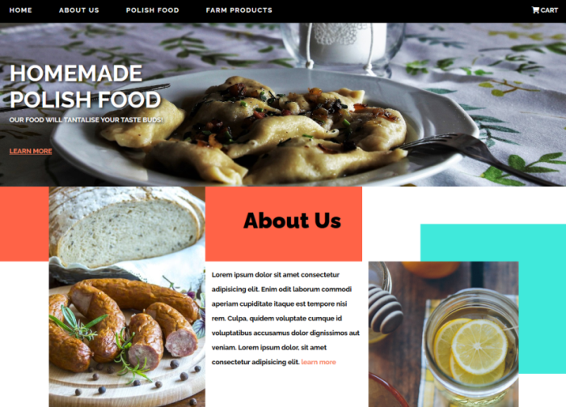
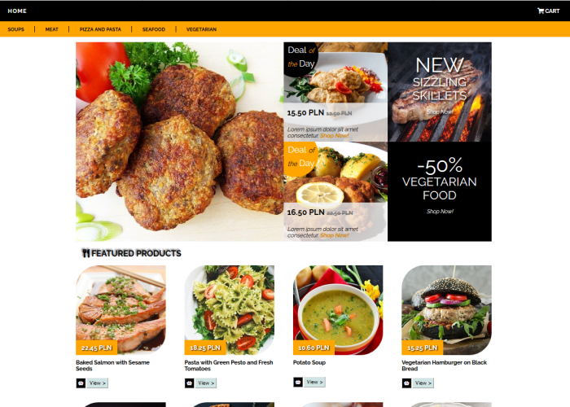

# jfdzr2-project-1

[Link to Layout 1](https://malgorzata-niemczyk.github.io/jfdzr2-project-1/project-1.html) - Landing Page of a Restaurant

[Link to Layout 2](https://malgorzata-niemczyk.github.io/jfdzr2-project-1/shopping-cart.html) - On-Line Shopping Cart

[Link to Layout 3](https://malgorzata-niemczyk.github.io/jfdzr2-project-1/online-product-list.html) - List of Products Offered by an On-line Shop

This was a 4 week long project built during my first module at InfoShare Academy. Project goal included using HTML and CSS to build three responsive webpage layouts.

The layouts I have chosen to build included: a landing page of a restaurant offering traditional food, an on-line shopping cart and a list of products offered by an on-line shop.

One of the main challenges I ran into while working on this project was building the layout 1 that was based quite a lot on CSS Grid as it recquired almost redesigning the webpage for each break point using media queries.